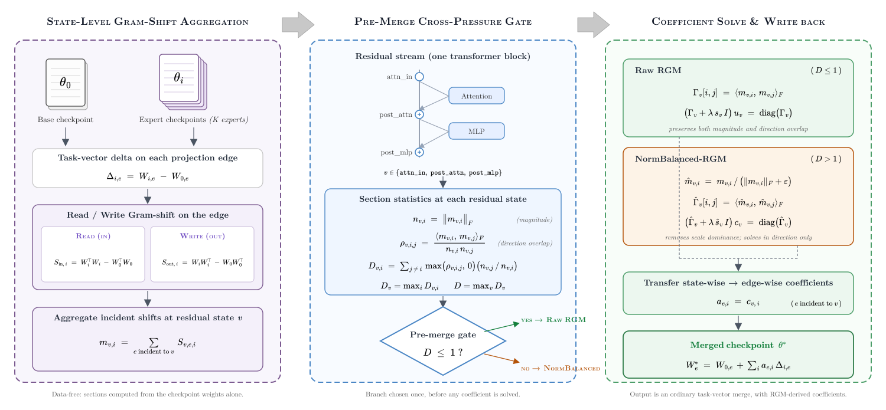

# Residual Geometry Merge



## Installation

```bash
git clone <repository-url>
cd rgm
python -m venv .venv
source .venv/bin/activate
python -m pip install --upgrade pip
python -m pip install -r requirements.txt
```

## One-Command Reproduction

Set `base` and each expert `path` in the selected configuration, then run the corresponding command:

```bash
# Qwen2.5-7B-Instruct
python scripts/run_setting.py --config configs/qwen25_7b_instruct.json --output-root outputs --device cuda

# DeepSeek-R1-Distill-Qwen-1.5B
python scripts/run_setting.py --config configs/deepseek_r1_distill_qwen_1p5b.json --output-root outputs --device cuda

# OpenMath-Nemotron-1.5B
python scripts/run_setting.py --config configs/openmath_nemotron_1p5b.json --output-root outputs --device cuda
```

The merged checkpoint is written to `outputs/<setting-id>/stage3_merge/merged_model/`.
